海底光缆是国际互联网的骨架。光缆的多少，代表一国与互联网的联系是否紧密。

有人利用微软的Bing地图，以及wikipedia的数据，做出了一幅互动式的[世界海底光缆分布图](http://www.cablemap.info/)。真是厉害啊。

[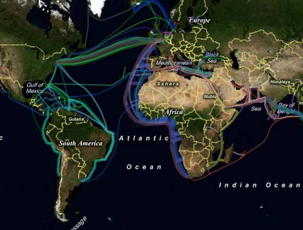](http://www.cablemap.info/)

我见过的这类地图中，它是最好用的一个。

从地图上可以看到，中国大陆的海底光缆连接点只有三个，因此非常容易对出入境的信息进行控制。

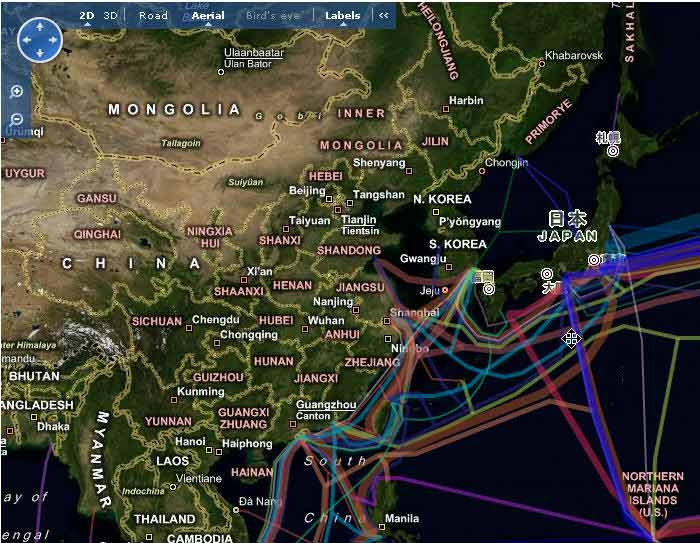

第一个是青岛（2条光缆）。

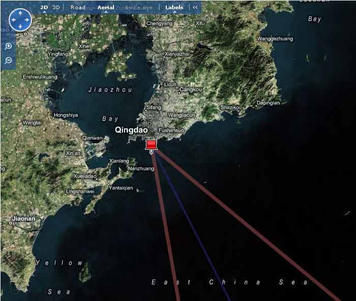

第二个是上海（6条光缆）。

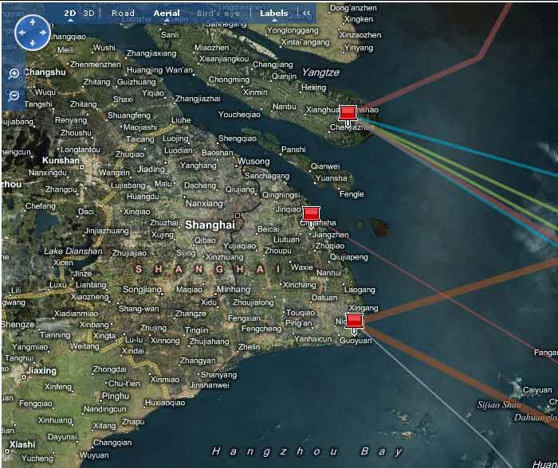

第三个是汕头（3条光缆）。

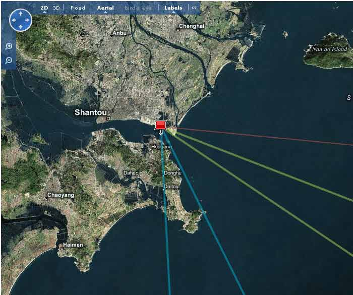

由于光缆之间存在重合，所以实际上，中国大陆与Internet的所有通道，就是3个入口6条光缆。

**1. APCN2（亚太二号）海底光缆**

带宽：2.56Tbps

长度：19000km

经过地区：中国大陆、香港、台湾、日本、韩国、马来西亚、菲律宾。

入境地点：汕头，上海。

网址：<http://en.wikipedia.org/wiki/APCN_2_(cable_system)>

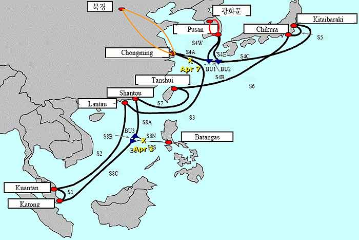

**2. CUCN（中美）海底光缆**

带宽：2.2Tbps

长度：30000km

经过地区：中国大陆，台湾，日本，韩国，美国。

入境地点：汕头，上海。

网址：<http://en.wikipedia.org/wiki/CUCN_(cable_system)>

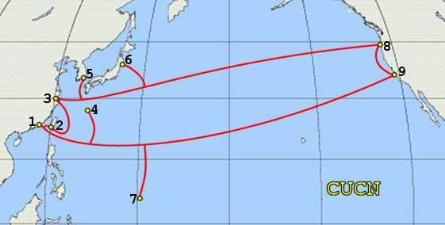

**3. SEA-ME-WE 3（亚欧）海底光缆**

带宽：960Gbps

长度：39000km

经过地区：东亚，东南亚，中东，西欧。

入境地点：汕头，上海。

网址：<http://en.wikipedia.org/wiki/SEA-ME-WE_3>

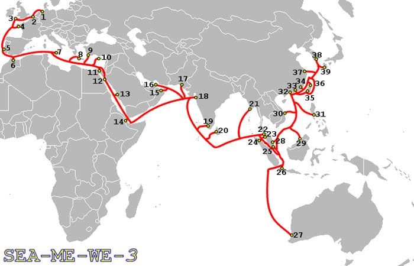

**4. EAC-C2C海底光缆**

带宽：10.24Tbps

长度：36800km

经过地区：亚太地区

入境地点：上海，青岛

网址：<http://en.wikipedia.org/wiki/C2C_(cable_system)>

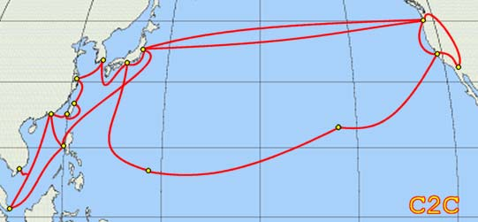

**5. FLAG海底光缆**

带宽：10Gbps

长度：27000km

经过地区：西欧，中东，南亚，东亚

入境地点：上海

网址：<http://en.wikipedia.org/wiki/Fiber-Optic_Link_Around_the_Globe>

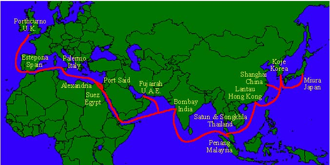

**6. Trans-Pacific Express（TPE，泛太平洋）海底光缆**

带宽：5.12Tbps

长度：17700km

经过地区：中国大陆，台湾，韩国，美国

入境地点：上海，青岛

网址：<http://en.wikipedia.org/wiki/TPE_(cable_system)>

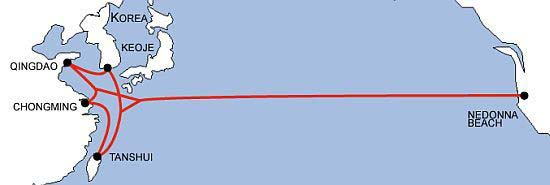

=============================

作为比较，台湾有9条光缆，香港和韩国各有11条光缆，而日本至少有11个入口15条光缆。